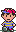

  
   
   
  
  
   
   
  
   
  

<!-- Social -->
<table width="100%" align="center">
  
  <tr>
  <td align="center">
  <a href="https://brunnerliv.io">
  <strong>Visit my personal website </strong>
   
   
   

  

  
  </a>
  

  </td>

  <td align="center">
  <a href="https://www.youtube.com/watch?v=3YxaaGgTQYM&ab_channel=EvanescenceVEVO">
  <strong>Listen to cool music</strong>
   
   

  

     
  </a>
  

  </td>
  </tr>
</table>

   

